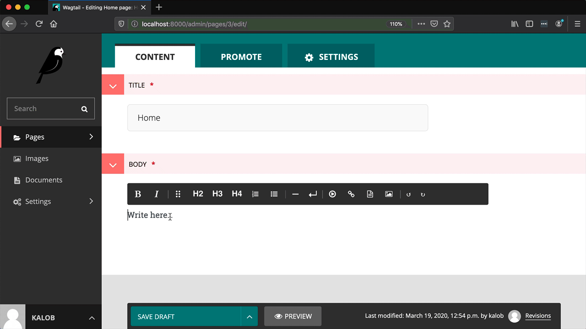

# Wagtail Buttons in Draftail
> Create buttons in their own block element inside of Draftail. Makes for easier button styling on the frontend. Created by [Eric Sherman](https://github.com/easherma) and [Kalob Taulien](https://github.com/kalobtaulien)




## Installation
1. Install the package
```bash
pip install git+https://github.com/KalobTaulien/wagtail-buttons#egg=wagtail-buttons
```
2. Add it to your `INSTALLED_APPS`
```python
INSTALLED_APPS = [
    # ...
    'wagtail_buttons',
]
```
3. Enable the `APPEND_BUTTON_BLOCK` setting with `APPEND_BUTTON_BLOCK = True` to automatically add the button block to all richtext editor instances, or manually add `features["button-block", "link"]` to your RichTextField and RichTextBlocks.
4. As Wagtail tries to stay frontend-agnostic, so does this package. You can style your buttons the same way you'd style links in the `.rich-text` class in your templates using CSS.

## Enabling your button block in RichText areas
You may or may not want a new RichText feature automatically added to every RichText field on your site. So by default this setting is disabled. But there are two ways to enable this feature:

1. Add `APPEND_BUTTON_BLOCK = True` to your settings. This will automatically enable button blocks on all of your RichText fields (and blocks), assuming you are not passing in a `features=[...]` parameter into your RichTextField or RichTextBlocks.

2. You can enable this feature one by one. Here are two examples:
```python
# As a Model Field
from wagtail.core.fields import RichTextField
from wagtail.core.models import Page

class YourPagePage(Page):
    body = RichTextField(features=["button-block", "link"])  # Other features can be enabled at the same time in this list.
    # ...
```

```python
# As a StreamField block
from wagtail.core import blocks

class YourStreamBlock(blocks.StructBlock):
    title = blocks.CharBlock(max_length=100)
    content = blocks.RichTextBlock(features=["button-block", "link"])
    # ...
```

## Styling your buttons in templates
In the frontend portion of your website, you'll want to style these buttons to match your sites theme. The quick CSS selector looks like this:

```css
.rich-text-buttons a {
    display: inline-block;
    border-radius: 3px;
    border: 1px solid #007d7e;
}
```

When you display your richtext in a Wagtail template file and there is a button block in the RichText content, your source code will have a `<div class="rich-text-buttons">..{your buttons here}</div>` in it. Styling is left up to you. See notes above about styling your buttons in the templates.

## Contibuting
The easiest way to get this up and running is to clone this repo into your Wagtail project and install it with pip's editable setting.

Example:
```bash
cd your-project/
git clone https://github.com/KalobTaulien/wagtail-buttons.git
pip install -e wagtail-buttons/
```
